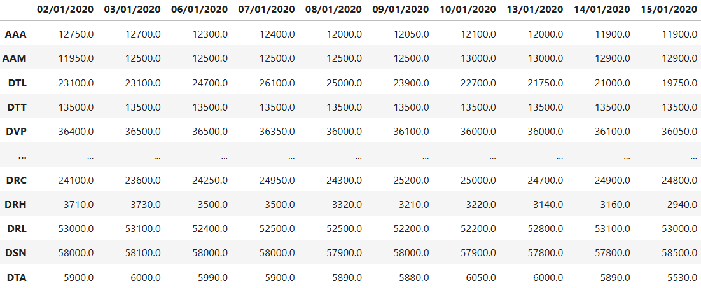
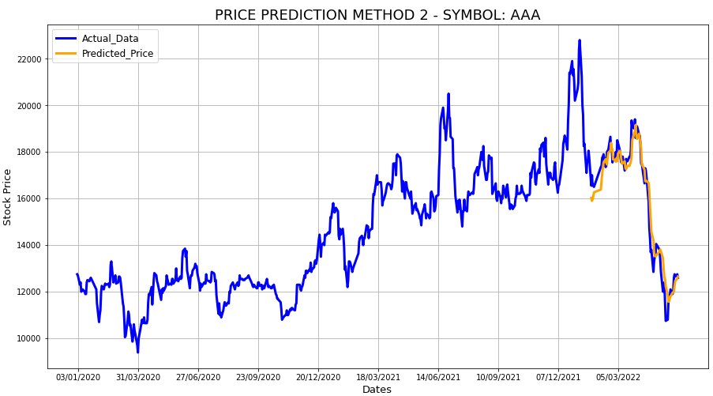

# Stock Price Prediction Using LSTM
[](https://github.com/TUT888/StockPricePrediction_LSTM/blob/main/README.md)
[](https://github.com/TUT888/StockPricePrediction_LSTM/blob/main/README.vi.md)

Web scraping and stock price prediction model <br>

**Note:** <br>

The project was completed on 31/05/2022, and the data was collected on the same day. <br>
The websites related to the web scraping section may have different structures in the future. Therefore, if the source code is run at a different time, some unexpected errors may occur.

## Project Description

The project includes following sections:

### 1. Data Collection - Web Scraping
- Selected 100 stock symbols from HOSE (Ho Chi Minh Stock Exchange): https://quotes.vcbs.com.vn/a/exchange.html
- Scraped the closing prices of stock symbols for the years 2020, 2021, and 2022.



### 2. Data Pre-processing
- Normalised data using TimeSeriesScalerMeanVariance.
- Plotted the the stock price chart over the given years.


### 3. Train and Predict
- Trained the LSTM model using collected data.
- Predicted the first 4 months of 2022. The prediction was done in 2 ways:
    - **Predict consecutive 4 months**: Using the values from the end of 2021, predicted the stock price trend for the first 4 months of 2022. In other words, the predicted values were used to predict more values. For example, the predicted price on 01/01/2022 was used to predict the price on 02/01/2022.

    
    - **Predict day by day**: Using the values from the end of 2021 and the beginning of 2022, predicted the stock price day by day for the first 4 months of 2022. In other words, only the available values were used to predict new values.

    

## Installation
### Install Chrome browser (if not installed already)
Download and install Chrome from the homepage: https://www.google.com/chrome/

### Download Chrome Driver for data collection
**Method 1: Manually download hromedriver**
<br> Select and download the suitable ChromeDriver at: https://chromedriver.storage.googleapis.com/index.html?path=100.0.4896.60/
<br>
- Ensure Chromedriver is compatible with the operating system.
- Since this source code is run on Windows, `chromedriver_win32.rar` was downloaded.
- After successfully downloading the driver, unzip the file to get chromedriver.exe.
- Place chromedriver.exe in the same folder as this project.

With this method, create the webdriver using:
```
from selenium import webdriver
wd = webdriver.Chrome(executable_path='chromedriver.exe')
```

**Note:**  If the following error occurs
*"SessionNotCreatedException: Message: session not created: This version of ChromeDriver only supports Chrome version 100"* when running the code *"webdriver.Chrome(executable_path='chromedriver.exe')"*, switch to method 2.
<br>

**Method 2: Using WebDriverManager library**
<br> Install WebDriverManager using
```
pip install webdriver-manager
```
With this method, create the webdriver using: 
```
from selenium import webdriver
from webdriver_manager.chrome import ChromeDriverManager
wd = webdriver.Chrome(ChromeDriverManager().install())
```

### Library versions

| Library | Version |
| --- | --- | 
| numpy | 1.19.5 |
| pandas | 1.1.5 |
| matplotlib | 3.3.4 |
| selenium | 3.141.0 |
| sklearn | 0.19.0 |
| tslearn | 0.5.2 |
| keras | 2.4.3 |

## Files in repository
- stock_price.ipynb: The main Jupyter Notebook file of the project.
- allDailyStockPrice.csv: CSV file containing the closing prices of all stock symbols over the years.
- chromedriver.exe: Chromedriver for Windows (should be replaced if the code is run on another operating system)
- dailyStockPriceCSV folder:
  - Contains the CSV files with closing prices of every stock symbol. 
  - stockHasLessData folder includes CSV files of other stock symbols that have less data than others.
