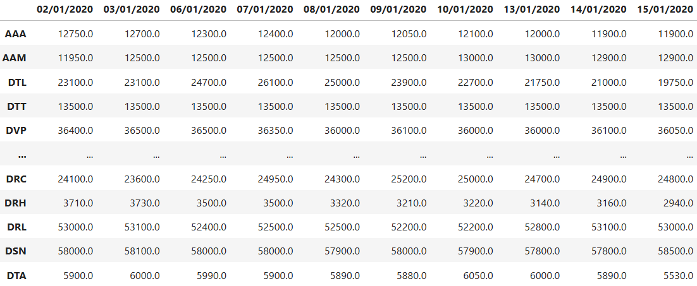
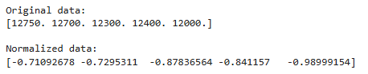
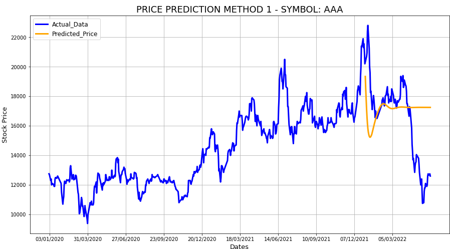

# Stock Price Prediction Using LSTM
[](https://github.com/TUT888/StockPricePrediction_LSTM/blob/main/README.md)
[](https://github.com/TUT888/StockPricePrediction_LSTM/blob/main/README.vi.md)

Thu thập dữ liệu và xây dựng mô hình dự đoán giá cổ phiếu <br>
Đây là nội dung thuộc một phần của đồ án cuối kỳ môn "Khai thác dữ liệu và khai phá tri thức" <br>

**Ghi chú:** <br>
Dự án được hoàn thành vào 31/05/2022, dữ liệu cũng được thu thập lần cuối vào ngày này.<br>
Các trang web liên quan đến phần thu thập dữ liệu có thể sẽ khác đi trong tương lai. Do đó, nếu mã nguồn phần thu thập dữ liệu được chạy vào thời điểm khác có thể sẽ xuất hiện một số lỗi không mong muốn.

## Project Description

Đồ án bao gồm các phần:

### 1. Thu thập dữ liệu (Data Collection)
- Lựa chọn 100 mã cổ phiếu từ HOSE (Ho Chi Minh Stock Exchange): https://quotes.vcbs.com.vn/a/exchange.html
- Thu thập dữ liệu giá đóng cửa (closing price) của các mã cổ phiếu trong những năm 2020, 2021, 2022



### 2. Tiền xử lý dữ liệu (Data Pre-processing)
- Chuẩn hóa dữ liệu bằng TimeSeriesScalerMeanVariance
- Vẽ biểu đồ thể hiện giá cổ phiếu qua các năm



### 3. Huấn luyện và dự đoán (Train and Predict)
- Huấn luyện mô hình dự đoán giá của một mã cổ phiếu dựa trên dữ liệu đã thu thập
- Dự đoán giá cổ phiếu của 4 tháng đầu năm 2022. Dự đoán theo 2 hướng:
  - Sử dụng giá trị của những ngày cuối năm 2021, để dự đoán giá cổ phiếu trong 4 tháng đầu của năm 2022 (có sử dụng những giá trị dự đoán được để dự đoán giá trị của ngày tiếp theo)

     
  - Sử dụng giá trị của những ngày cuối năm 2021 và đầu năm 2022, để dự đoán giá cổ phiếu của từng ngày trong 4 tháng đầu của năm 2022 (sử dụng giá trị sẵn có, để dự đoán giá trị của ngày kế tiếp)

     

## Installation
### Cài đặt trình duyệt Chrome (nếu chưa có)
Tải và cài đặt Chrome từ trang chủ: https://www.google.com/chrome/

### Tải Chrome Driver để thu thập dữ liệu
**Cách 1: Tải chromedriver thủ công**
<br> Lựa chọn và tải phiên bản Chrome Driver phù hợp tại: https://chromedriver.storage.googleapis.com/index.html?path=100.0.4896.60/
<br>
- Chromedriver cần được tải đúng phiên bản tương ứng với hệ điều hành sử dụng
- Phần source code này được chạy trên hệ điều hành Windows, vì vậy chromedriver_win32.rar sẽ được tải và sử dụng.
- Sau khi tải thành công, ta giải nén file ta nhận được file chromedriver.exe
- Đặt file chromedriver.exe chung với thư mục chứa file code này

Với phương pháp này, khi tạo webdriver ta sử dụng lệnh 
```
from selenium import webdriver
wd = webdriver.Chrome(executable_path='chromedriver.exe')
```

**Lưu ý:** Nếu sử dụng phương pháp 1 gặp lỗi
*"SessionNotCreatedException: Message: session not created: This version of ChromeDriver only supports Chrome version 100"* khi chạy dòng lệnh *"webdriver.Chrome(executable_path='chromedriver.exe')"*, ta có thể sử dụng phương pháp 2
<br>

**Cách 2: Sử dụng thư viện WebDriverManager**
<br> Cài đặt WebDriverManager bằng lệnh
```
pip install webdriver-manager
```
Với phương pháp này, khi tạo webdriver ta sử dụng lệnh 
```
from selenium import webdriver
from webdriver_manager.chrome import ChromeDriverManager
wd = webdriver.Chrome(ChromeDriverManager().install())
```

### Phiên bản sử dụng của một số thư viện

| Library | Version |
| --- | --- | 
| numpy | 1.19.5 |
| pandas | 1.1.5 |
| matplotlib | 3.3.4 |
| selenium | 3.141.0 |
| sklearn | 0.19.0 |
| tslearn | 0.5.2 |
| keras | 2.4.3 |

## Files in repository
- stock_price.ipynb: file Jupyter Notebook của dự án
- allDailyStockPrice.csv: file csv tổng hợp giá đóng cửa (closing price) của các mã cổ phiếu qua các năm
- chromedriver.exe: file chromedriver dành cho window (cần được thay thế nếu mã nguồn được chạy trên hệ điều hành khác)
- Folder dailyStockPriceCSV
  - Gồm các file csv chứa dữ liệu giá đóng cửa (closing price) đã thu thập của từng mã cổ phiếu
  - Folder stockHasLessData bao gồm các file csv của các mã cổ phiếu có dữ liệu ít hơn so với các mã còn lại
